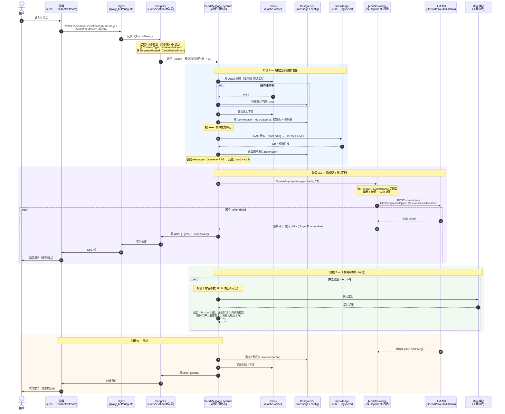
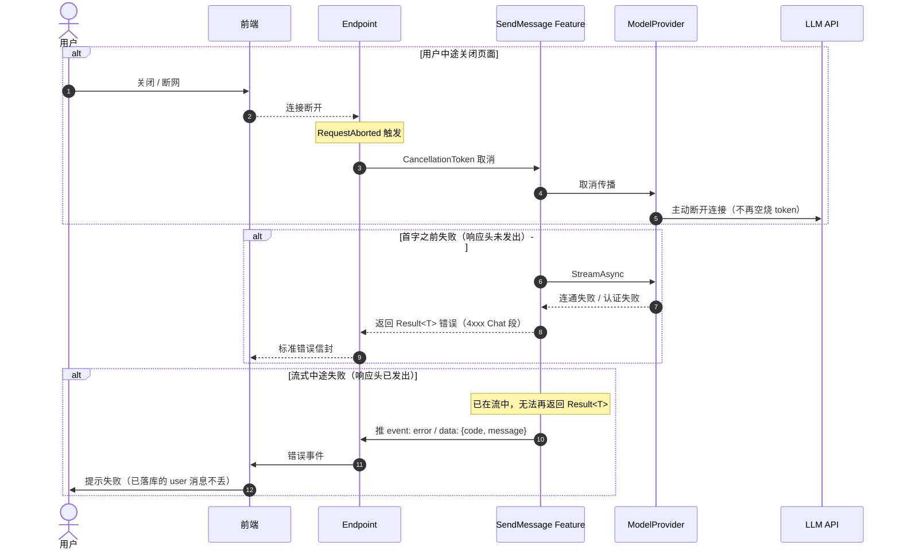

# 对话引擎：一次流式对话的端到端时序

> 场景：用户向某个 Agent 发送一条消息，前端通过 SSE 收到流式回复；其中可能触发一次 MCP 工具调用。
> 对应模块：`Hify.Modules.Conversation`（L2 编排层）→ `Agent` / `Knowledge` / `ModelProvider` / `Mcp`。

## 总体时序图

## 异常路径

## 关键技术点（流式的"命门"）

整条链路的本质是一个跨 4 层的**背压管道**，没有任何一层"先收全再转发"。任意一层做了缓冲/聚合，流式都会断在那一层：

| 层 | 正确做法 | 错误做法（会断流） |
|---|---|---|
| 前端 | 原生 `fetch` + `ReadableStream` | axios（等响应体完整才 resolve） |
| Nginx | `proxy_buffering off` | 默认 buffering（攒一坨再发） |
| Endpoint | 每帧 `Response.Body` + `FlushAsync()` | 攒完整字符串再写 / 忘记 Flush |
| HttpClient | `HttpCompletionOption.ResponseHeadersRead` | 默认 `ResponseContentRead`（等下载完） |

其它要点：

- **CancellationToken 全程透传**（Endpoint `RequestAborted` → Service → ModelProvider → HttpClient），用户断开即取消对 LLM 的调用。
- **一次用户请求 ≠ 一次 LLM 调用**：工具调用循环让调模型次数运行时才确定，需设最大轮次上限。
- **超时分级**：SSE 流式 120s、同步 60s、连通性测试 10s；每提供商独立熔断器 + 舱壁隔离。
- **LLM 输出不可信**：工具名/参数落库或执行前必须校验。
